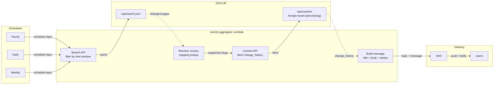
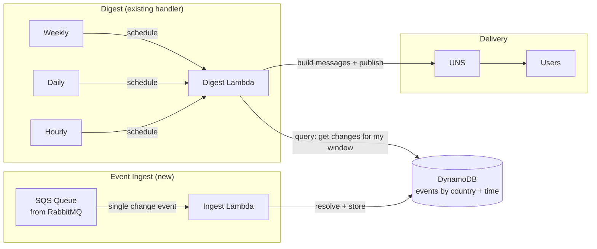

# events-aggregator

Stateless Lambda service that polls GOV.UK travel advice for changes and publishes notifications to UNS (Unified Notification Service).

## How it works



Three EventBridge schedules (hourly, daily, weekly) trigger the same Lambda with a different `schedule` input. Each run:

1. Queries the GOV.UK Search API for travel advice pages updated within the time window
2. Resolves each result against an in-code country mapping (keyed on `content_id`)
3. Fetches full change history from the GOV.UK Content API (rate-limited to 10 req/s)
4. Builds notification messages from relevant changes
5. Publishes to UNS with a topic per country/frequency (e.g. `travel-advice/pakistan/weekly`)

Unknown countries are logged for manual triage. Failed content fetches are retried 3x with backoff, then skipped — other countries continue.

## Development

```bash
pnpm install
pnpm run test          # 47 tests
pnpm run types:check   # TypeScript
pnpm run lint:check    # ESLint
pnpm run cdk synth     # CloudFormation output
```

## Simulate

Run the handler against the real GOV.UK APIs in dry-run mode (no messages sent to UNS):

```bash
# What would the weekly digest produce right now?
pnpm run --silent simulate --schedule weekly | jq .

# Anchor to a specific country's last change (guarantees a hit)
pnpm run --silent simulate --schedule hourly --country pakistan | jq .

# Filter to just the notification messages
pnpm run --silent simulate --schedule weekly --country mexico \
  | jq 'select(.message == "DRY RUN — would publish") | {topic, NotificationTitle, NotificationBody}'
```

`--schedule` is required (`hourly`, `daily`, or `weekly`). Output is JSON lines (one per log entry), pipeable through `jq`.

`--country` is optional — filters to a single country slug and anchors the time window to that country's last change, so you always get a hit regardless of schedule.

## Event payload

The Lambda accepts a JSON event from EventBridge:

```json
{
  "schedule": "hourly",
  "dryRun": false,
  "country": null,
  "windowStart": null
}
```

| Field | Required | Description |
|-------|----------|-------------|
| `schedule` | Yes | `hourly`, `daily`, or `weekly` |
| `dryRun` | No | Log messages instead of publishing to UNS |
| `country` | No | Only process this country slug |
| `windowStart` | No | Override the computed time window start (ISO 8601) |

In production, EventBridge rules pass only `{"schedule": "hourly"}`. The other fields are for local testing and debugging.

## Notification message format

Messages are published to a UNS topic per country and frequency:

```
travel-advice/{country-slug}/{frequency}
```

For example: `travel-advice/pakistan/weekly`, `travel-advice/mexico/hourly`

Each message follows the UNS notification contract:

| Field | Description |
|-------|-------------|
| `topic` | Target topic (e.g. `travel-advice/pakistan/weekly`) |
| `NotificationID` | SHA-256 dedup marker (slug + schedule + change content) |
| `NotificationTitle` | Push notification title (e.g. "Pakistan travel advice updated") |
| `NotificationBody` | Push notification body (latest change note, or count summary) |
| `MessageTitle` | App notification centre title |
| `MessageBody` | Full roll-up as markdown bullet list |

## Infrastructure

CDK stack (`cdk/stacks/events-aggregator-stack.ts`) deploys:

- 1 Lambda (Node.js 22, 256MB, 60s timeout)
- 3 EventBridge rules (hourly, daily, weekly)
- KMS encryption for logs
- SNS alarm topic with Lambda error rate alarms

```bash
ENVIRONMENT=dev pnpm run cdk synth
ENVIRONMENT=dev pnpm run cdk:deploy
```

## Configuration

Lambda environment variables:

| Variable | Description |
|----------|-------------|
| `UNS_API_URL` | UNS API endpoint |
| `UNS_API_REGION` | Signing region (default: `eu-west-2`) |
| `UNS_SIGV4_ENABLED` | `true` to sign requests with SigV4 |

## Project structure

```
src/
  handler.ts              # Lambda entry point
  config.ts               # Schedule validation, time windows, UNS config
  govuk/
    searchApi.ts          # GOV.UK Search API client
    contentApi.ts         # Content API with retry + rate limiting
    types.ts              # GOV.UK response types
  countries/
    mapping.ts            # content_id → country lookup (226 countries)
  notifications/
    messageBuilder.ts     # Builds notification messages with dedup marker
    unsClient.ts          # UNS publish with optional SigV4 signing
scripts/
  simulate.ts             # Local dry-run harness
cdk/
  stacks/                 # CDK stack definition
  cdk_constructs/         # Shared CDK constructs (from service-template)
  constants/              # Service metadata, environment helpers
```

## Future: push model from GOV.UK

If GOV.UK publishes change events to a queue (e.g. RabbitMQ), the polling is replaced by an event-sourced pattern. Events arrive one at a time and accumulate in DynamoDB. The digest Lambda stays the same — it just reads from DynamoDB instead of the GOV.UK APIs.



**The key insight:** today the handler calls the Search API ("what changed in my window?") then the Content API ("what are the details?"). In the push model, those two steps collapse into a single DynamoDB query — "get me all events in the last hour/day/week." The events already contain the change details because they arrived as individual events and were stored as-is.

**What's new:**
- Ingest Lambda: receives a single event from SQS, calls `resolveCountry`, writes `{ slug, changeNote, timestamp }` to DynamoDB
- DynamoDB table: partition key = `slug`, sort key = `timestamp`, TTL = 8 days
- SQS queue (bridged from RabbitMQ)

**What changes in the digest Lambda:**
- Replace `fetchChangedTravelAdvice` + `fetchCountriesBatch` with one DynamoDB query: "all items where timestamp >= windowStart"
- The result is the same shape — a list of countries with their change notes — so `buildMessage` and `publishToUns` work unchanged

**What stays identical:**
- `resolveCountry`, `buildMessage`, `publishToUns`
- Topic format, notification contract, dedup marker
- EventBridge schedules, dryRun/country/windowStart overrides
- Security hardening, alarms, CDK patterns

## TODO

- [ ] Configure Lambda in VPC with access to UNS private API Gateway endpoint (same pattern as Flex)
- [ ] Scope Lambda IAM role to `execute-api:Invoke` on the UNS API ARN only (blocked on UNS account/ARN details)
- [ ] Wire up IAM cross-account trust for SigV4 calls to UNS (UNS needs our account ID + VPC endpoint ID in its config)
- [ ] Populate full country mapping from live `/api/content/foreign-travel-advice` endpoint (currently 226, but new countries may appear)
